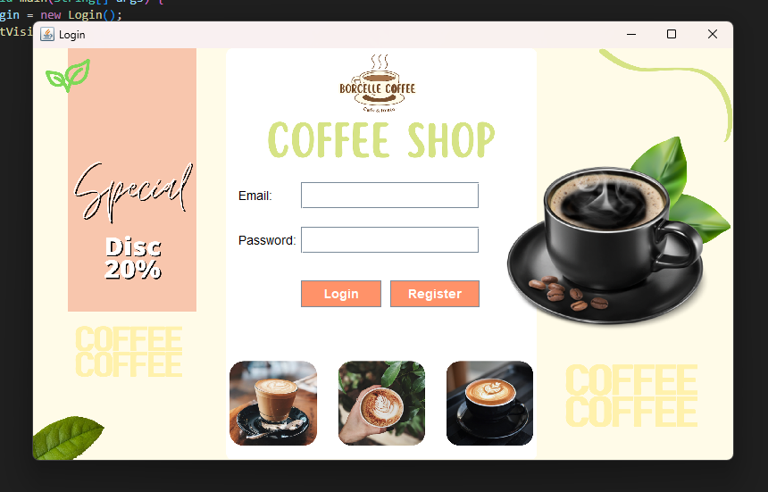
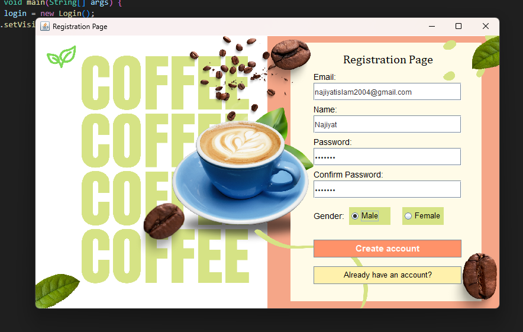
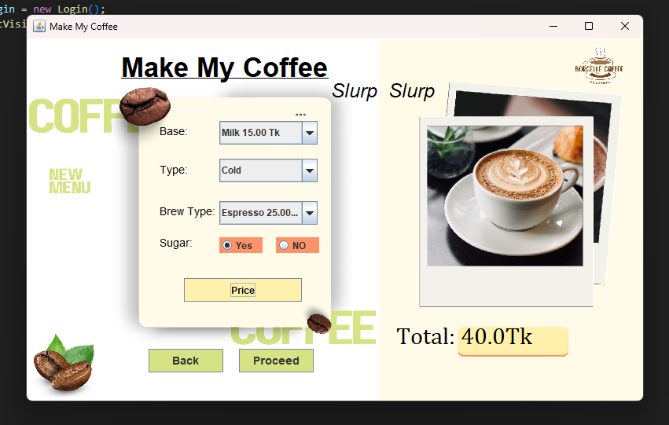
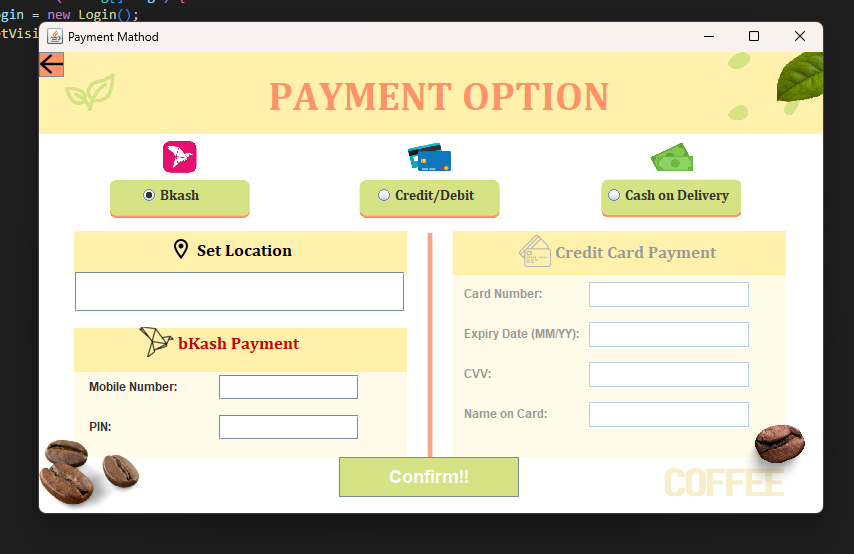

# Coffee Shop Billing Management System

This is a Java project for managing coffee shop billing and orders. It allows customers to customize their coffee and make payments via multiple methods, including bKash, Credit/Debit Card, and Cash on Delivery.

## Features

- Customize coffee orders (base, type, brew, sugar)
- Price calculation for customized coffee
- Multiple payment options (bKash, Credit/Debit, Cash on Delivery)
- User-friendly interface with smooth navigation

## Setup Instructions

- Clone the repository to your local machine.
- Open the solution in your IDE (e.g., Eclipse or IntelliJ).
- Set up the project configuration in your IDE.
- Build and run the application.

## Usage

Once configured, you can use the system to:
- Order coffee by selecting different customization options.
- Make payments via your preferred payment method.
- Enjoy your customized coffee!

## Screenshots

1. Login Page  
   

2. Registration Page  
   

3. Coffee Order Page  
   

4. Payment Option Page  
   

## How to Use

1. Clone the repository to your local machine:
   ```bash
   git clone https://github.com/your-username/CoffeeShopBillingManagementSystem.git
