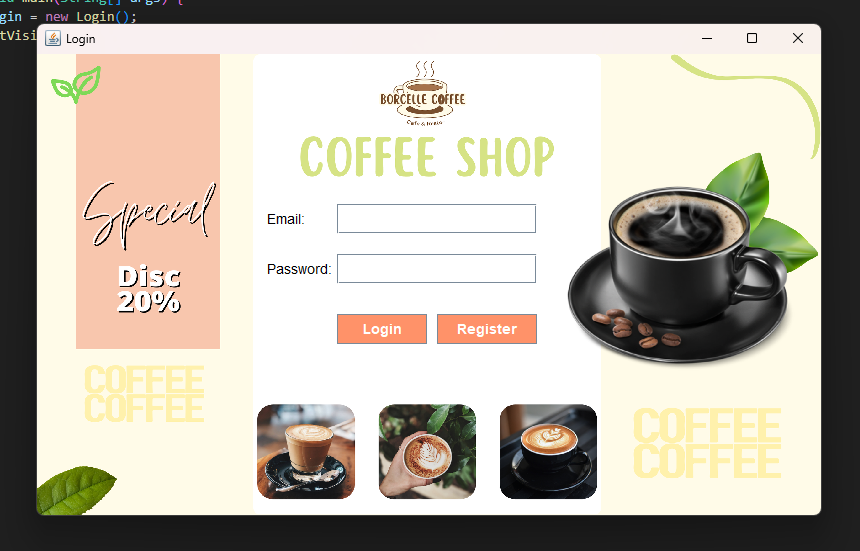
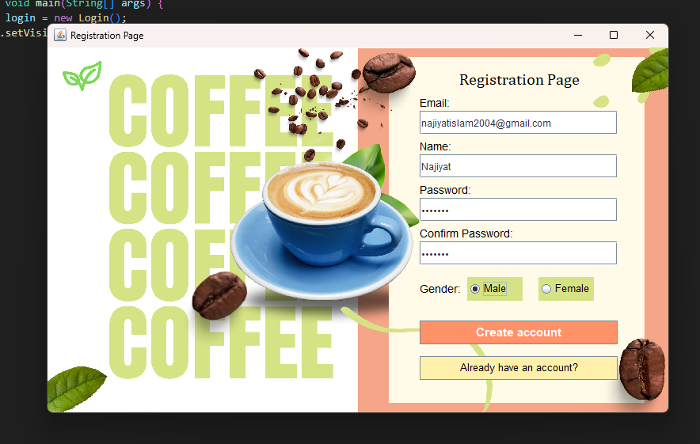
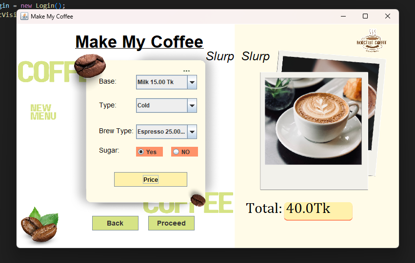
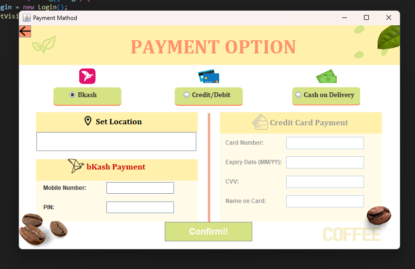

# CoffeeShopBillingManagementSystem

This is a Java-based Coffee Shop Billing Management System. It is developed using Java Swing for managing coffee orders, calculating prices, and handling payments.

## Features

- User login and registration.
- Coffee ordering system.
- Customize coffee ingredients.
- Automatic price calculation.
- Multiple payment options.
- Simple and user-friendly interface.

## Setup Instructions

- Clone the repository to your local machine.
- Open the project in Eclipse, IntelliJ IDEA, or another Java IDE.
- Add the `src` folder as the source folder.
- Make sure the `assets` folder is available in the project root.
- Build and run the project.
- Run `Start.java`.

## Usage

Once the application is running, users can register or log in, select coffee and ingredients, customize their order, calculate the total price, and complete the payment.

## Coffee Shop Billing Management System - User Interface Screenshots

1. **Login Page**  
   

2. **Registration Page**  
   

3. **Coffee Order Page**  
   

4. **Payment Page**  
   

## How to Use

1. Clone the repository to your local machine:

   ```bash
   git clone https://github.com/munshi-rishad/CoffeeShopBillingManagementSystem-Repository.git
